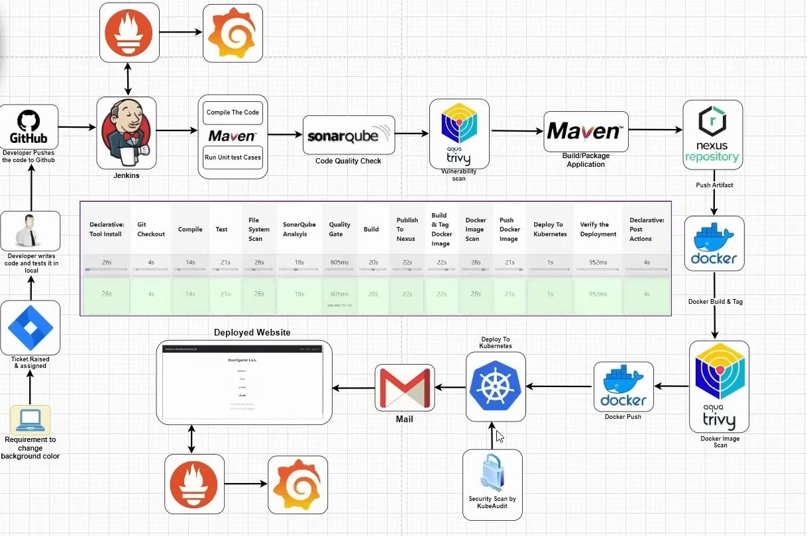

# 🚀 BoardGame Review App with CI/CD & Kubernetes Deployment

## 📌 Overview

Production-ready full-stack Board Game Review application built using Spring Boot and deployed using a complete DevOps pipeline.

This project demonstrates **end-to-end DevOps practices** including CI/CD automation, containerization, security scanning, and Kubernetes deployment.

Users can browse, add, and review board games, while role-based access control ensures proper authorization between users and managers.

---

## 🏗️ Architecture Diagram



---

## ⚙️ Tech Stack

### Backend

* Java
* Spring Boot
* Spring MVC
* Spring Security
* JDBC
* H2 Database

### Frontend

* Thymeleaf
* HTML5, CSS3, JavaScript
* Bootstrap

### DevOps & Tools

* Docker
* Kubernetes
* Jenkins
* SonarQube
* Trivy
* Nexus Repository
* AWS EC2

### Testing

* JUnit

---

## 🔄 DevOps Implementation

* CI/CD pipeline using Jenkins
* Automated build and test using Maven
* Code quality analysis with SonarQube
* Vulnerability scanning using Trivy
* Artifact storage using Nexus Repository
* Docker containerization
* Kubernetes deployment
* Monitoring using Prometheus and Grafana

---

## ✨ Features

* Role-based authentication (User / Manager)
* Secure login using Spring Security
* CRUD operations for board games and reviews
* Responsive UI using Bootstrap
* Full-stack web application
* Deployed on AWS EC2
* Integrated CI/CD pipeline

---

## 👥 User Roles

* **Guest (Non-member)**

  * View board games and reviews

* **User**

  * Add board games
  * Write reviews

* **Manager**

  * Edit and delete reviews
  * All user permissions

---

## ▶️ Running the Application

### 1. Clone the Repository

```
git clone https://github.com/your-username/your-repo.git
cd your-repo
```

### 2. Build the Project

```
mvn clean package
```

### 3. Run the Application

```
java -jar target/*.jar
```

### 4. Access the App

```
http://localhost:8080
```

---

## 🐳 Docker Setup

### Build Image

```
docker build -t yourusername/boardgame-app .
```

### Run Container

```
docker run -p 8080:8080 yourusername/boardgame-app
```

---

## ☁️ Deployment

* Application deployed on AWS EC2
* Docker container used for consistent deployment
* Kubernetes used for container orchestration

---

## 🔐 Demo Credentials (Optional)

* **User**

  * Username: bugs
  * Password: bunny

* **Manager**

  * Username: daffy
  * Password: duck

---

## 📈 Future Improvements

* Add persistent database (MySQL/PostgreSQL)
* Implement Infrastructure as Code using Terraform
* Add centralized logging (ELK Stack)
* Implement auto-scaling in Kubernetes
* Improve security with secret management tools

---

## 📬 Contact

If you want to discuss this project or collaborate, feel free to connect.
